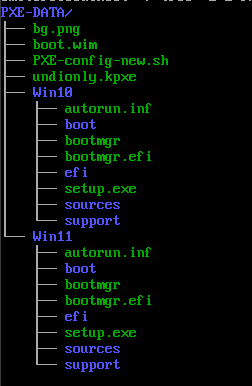

# OVERVIEW
### All required packages
1. iPXE
	- make
	- gcc
	- binutils
	- perl
	- mtools
	- mkisofs
	- syslinux
	- liblzma5
	- ~~isolinux~~ - **This one is missing in openSUSE**
2. Other Packages
	- yast2-dhcp-server 
	- yast2-tftp-server 
	- apache2 
	- git 
	- yast2-nfs-server 
	- tftp
 	- dhcp-server 
	- samba 
	- yast2-samba-server 
	- nfs-kernel-server 
	- pv

# About
> [!NOTE]
> All tests have been performed on Virtual Machines!  
> Software used: Oracle Virtual Box 7.0.14 r161095 (Qt5.15.2), libvirt  
> OS: openSUSE Leap (nogui just server 'edition'), Windows 10    

> [!IMPORTANT]
> Script should be run as `su` or with `sudo` command!


At first I want to mention that **I'M NOT** a professional bash scripts writer 😝 So if you find something wrong in script, just let me know and if you know solution for that I would be grateful if you share the solution with me.

Now I want to say thank you to:
- [rpi4cluster Owner](https://rpi4cluster.com/) - So far the best site with iPXE configuration for Windows Support (but I'm kinda sad there is no Linux documentation 😆)
- [Guys from openSUSE Forum](https://forums.opensuse.org/) - Now I can't remeber for what I was looking for but I'm sure I've found something there
- [Microsoft](https://www.microsoft.com) - for Windows 10, Windows 11 and Windows PE (but please do something with your documentation and `copype.cmd` script...)
- [CloneZilla Owner](https://clonezilla.org/) - for the best cloning cloning software!
- [iPXE Owner](ipxe.org) - for the best PXE firmware!

# LICENSE
I don't know what license should I choose so I'll say this - feel to use this script, make changes or whatever you want but make sure you aren't breaking the license rules of above corporations/people.

If you appreciate my work [you can buy me a coffee](https://help.buymeacoffee.com/en/)

# WORTH TO KNOW

As you could see in an [Overview](#overview) there is one package missing in openSUSE - `isolinux`. What does it mean? You **CAN'T** generate `undionly.kpxe` file which is required to run iPXE on BIOS systems. If you want to do that, you have to use (rpi4cluster)[https://rpi4cluster.com/ipxe/] guide using Ubuntu (I know there is that package) and then copy this file. Maybe in future I'll find a way to make that file but now I don't have time and knowledge how to do this.

If you want to configure **SAMBA SERVER** using different Linux Account than the one already created you have to make new LINUX ACCOUNT, ie:

Your default account is `pxe-admin`. So if you are creating samba server, you **HAVE TO** put `pxe-admin` as username, because it's stored in a variable `$smb_username`. So it's looking something like this:

1. You are putting username which is already created
2. Script is using `smbpasswd $smb_username -a` command
3. Then it's asking for password for samba share
4. If password is wrong or there is no account with `$smb_username` name srcipt is returning error and you have to re-run script

And now we are getting to my favourite section:

---------- Windows Lack of Technology 🤣 ----------

Because of Microsoft's brilliant technological thought I didn't find a good way to download latest .iso files of both Windows 10 and 11. For now you HAVE TO download them manually and put successivly in:

	Windows 10 installation files - /home/$USER/PXE-DATA/Win10
	Windows 11 installation files - /home/$USER/PXE-DATA/Win11

Same thing with 'boot.wim' file - it SHOULD BE in /home/$USER/PXE-DATA/ folder. But what exactly 'boot.wim' file is? 
'boot.wim' file is kinda (???) universal Windows bootloader. You can use it with Windows 10 and Windows 11, and it is loaded by ipxe's 'wimboot' file. 'wimboot' is loading 'boot.wim' and then Windows Preinstalation Enviroment is loaded.

To get 'boot.wim' file you have to follow [Microsoft's Official Documentation](https://learn.microsoft.com/pl-pl/windows-hardware/manufacture/desktop/download-winpe--windows-pe?view=windows-11) and - one more time - because of Microsoft's brilliant technological thought, you have to [edit one scritp](https://777notes.wordpress.com/2013/10/21/winpe-the-following-processor-architecture-was-not-found-amd64/).

If you have any problems with script or other things that are needed to script work feel free to contact me via email: gubisiowy@gmail.com.

PXE-DATA tree should look the same as below:


```
PXE-DATA
|
--- bg.png
|
--- boot.wim
|
--- Win10
|   |
|   --- Windows 10 installation files
|
--- Win11
|   |
|   --- Windows 11 installation files
```
If there is not Windows 10 or 11 installation files, script will not work unless I'll find a good way to download .iso from Official Servers. Then whole script will be changed.

If you want to change background image simply put image in `/home/$USER/PXE-DATA` or in `$path/Other/bg.png`. Note that you have to enable this option in script and your background image name **SHOULD BE** `bg.png` and it has to be 1024x768px!

And one more thing - if you made a mistake while writing something ie. while writing IP addresses, it's prefered to re-run script. Because later this IP addresses are present in '.efi', (in future) '.kpxe', DHCP, NFS files so it'll be easier to write it one more time than correcting and generating all files "by hand".

I think that's all. One more time - if you have any questions - feel free to ask. My email address: gubisiowy@gmail.com.

Have a good day and I wish you a lot of Windows installations and disks clones haha.

# KNOWN ISSIUES
- Custom Samba share name is not working
- ~~iPXE can't load due to background image - so if you don't need a background image skip this step~~
- ~~Generating Windows `.ipxe` file is broken (idk why, it was working earlier 🤔)~~

# TO DO
- Find a way to download latest `.iso` of Windows 10 and 11 and other OSes/softwares
- Find a way to generate `.kpxe` file
- Add GUI
- Add more options to PXE such as Hirens, MEMTEST and similar
- Make a script prettier
- Migration to Kea DHCP
- Better DHCP configuration function
- Add [TRUE/FALSE] variables instead of checking if file exists
- git clone only readfile or check if in same path as `.sh` file is `.md` file or smth
- And (for now) things I have no idea about 😝
